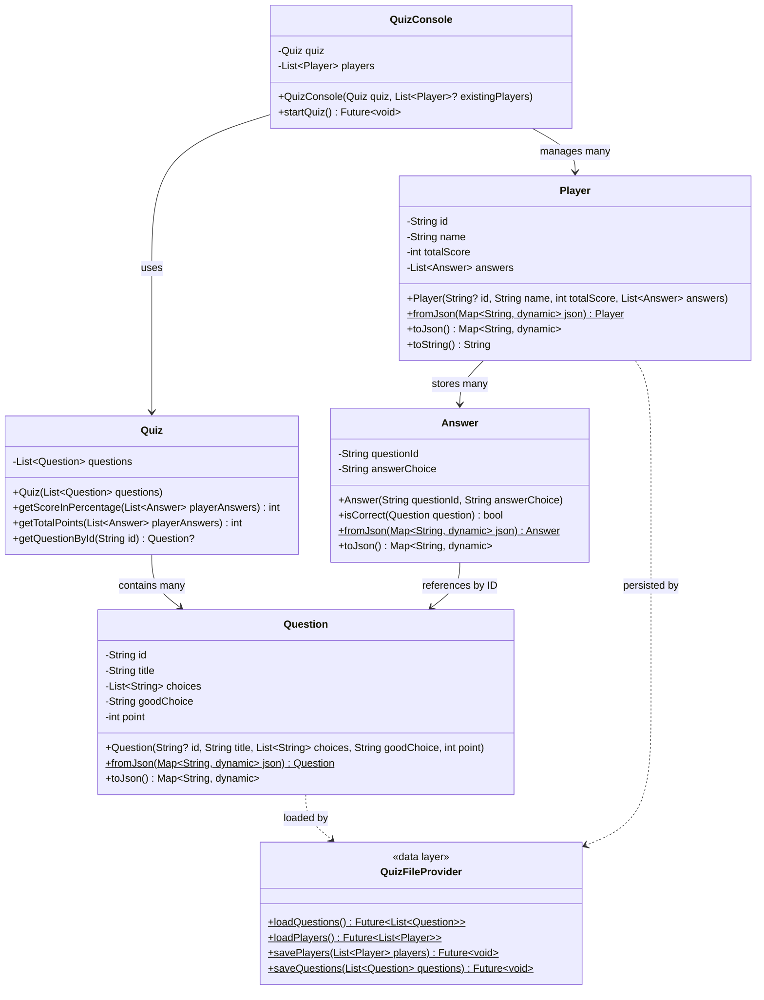

# 🎯 Console Quiz (Dart)

[](W3%20-%20PRACTICE%20-%20Dart%20Layered%20Architecture.pdf)

A clean, modern, and test-covered console quiz app built with Dart. Questions are loaded from JSON, converted into typed models, and played interactively in your terminal.

> School base-project — created for coursework and learning purposes.  
> Owner: Loem KimHour

[▶ View Assignment PDF](W3%20-%20PRACTICE%20-%20Dart%20Layered%20Architecture.pdf)


---

## ⚡️ Highlights

- **Layered Architecture**: Clean separation of data, domain, and UI layers
- **JSON-driven**: Questions loaded from `lib/data/questions.json`
- **Player Persistence**: Scores and answers saved to `lib/data/players.json`
- **Strong models**: `Question`, `Answer`, `Quiz`, `Player`
- **Auto-generated UUIDs** for Questions and Players
- **Security-focused**: Answers only store question IDs, not full question details
- **Case-insensitive** answer checking
- **Multi-player support** with duplicate name handling
- **Comprehensive unit tests** covering all features

---

## 💢 UML Diagram



---

## 🧭 Table of Contents

- Overview
- Demo
- Project Structure
- Getting Started (Requirements, Setup, Run, Test)
- Data Format (JSON)
- Architecture
- Customize
- Troubleshooting
- Ownership & Status
- License

---

## 🔎 Overview

This project demonstrates a small but well-structured console application in Dart. Data is read from JSON, mapped into strongly-typed models, and processed by a tiny domain layer. The UI loop lives in the console, keeping concerns separate and the code easy to follow.

---

## 🖥️ Demo (text transcript)

```text
$ dart lib/main.dart
--- Welcome to the Quiz ---

Your name (or press Enter to quit): Alice

Question: Capital of France? - (10 Points)
Choices: [Paris, London, Rome]
Your answer: paris

Question: 2 + 2 = ? - (50 Points)
Choices: [2, 4, 5]
Your answer: 4

ALICE, your score: 100% correct
ALICE, your total points: 60
(New player record created)

--- Leaderboard ---
Player: ALICE     Score: 60

Your name (or press Enter to quit): 
✓ Players saved successfully

--- Quiz Finished ---
```

---

## 🗂 Project Structure

```
lib/
  main.dart                 # Entry: loads data from provider, starts console UI
  data/                     # DATA LAYER
    quiz_file_provider.dart # Handles all file operations (questions & players)
    questions.json          # Quiz questions (input)
    players.json            # Player records with scores (auto-generated)
  domain/                   # DOMAIN LAYER
    quiz.dart               # Question, Answer, Quiz, Player models & logic
  ui/                       # UI LAYER
    quiz_console.dart       # Console interaction loop

test/
  quiz_test.dart            # Unit tests for core behavior
pubspec.yaml                # Dependencies: uuid, test
```

---

## 🚀 Getting Started

### Requirements
- Dart SDK 3.x

### Setup
```bash
# From the project root
dart pub get
```

### Run
```bash
# From the project root
dart lib/main.dart
```

### Test
```bash
# From the project root
dart test
```

---

## 🧾 Data Format (JSON)

### Questions (`lib/data/questions.json`)

```json
{
  "questions": [
    {
      "id": "optional-string-id",
      "title": "Capital of France?",
      "choices": ["Paris", "London", "Rome"],
      "goodChoice": "Paris",
      "point": 10
    }
  ]
}
```

### Players (`lib/data/players.json` - auto-generated)

```json
{
  "players": [
    {
      "id": "uuid-v4-string",
      "name": "ALICE",
      "totalScore": 60,
      "answers": [
        {
          "questionId": "question-uuid",
          "answerChoice": "Paris"
        }
      ]
    }
  ]
}
```

**Notes:**
- Question `id` is optional. If omitted, a UUID v4 is generated automatically.
- `goodChoice` is compared case-insensitively during answer checks.
- Player records are automatically saved after each quiz session.
- Answers only store question IDs, keeping question details private.

---

## 🧠 Architecture

### Layered Design

This project follows **Clean Architecture** principles with three distinct layers:

#### 🗄️ Data Layer (`lib/data/`)
- **`quiz_file_provider.dart`**: Handles all file I/O operations
  - `loadQuestions()`: Reads questions from JSON
  - `loadPlayers()`: Reads player records from JSON
  - `savePlayers()`: Persists player data to JSON
  - `saveQuestions()`: Saves questions with generated IDs back to JSON (ensures ID persistence)
- **Benefits**: Main code never touches raw files; easy to swap storage (e.g., to a database)

#### 🧩 Domain Layer (`lib/domain/`)
- **`Question`**: Represents a quiz question
  - Auto-generates UUID if not provided
  - `fromJson()` / `toJson()` for serialization
- **`Answer`**: Stores question ID and answer choice
  - Only references question by ID (security: keeps question details private)
  - `isCorrect(Question)`: Case-insensitive validation
- **`Quiz`**: Manages questions and scoring logic
  - No longer stores answers (answers belong to players)
  - `getScoreInPercentage(List<Answer>)`: Calculate percentage score
  - `getTotalPoints(List<Answer>)`: Calculate point total
  - `getQuestionById(String)`: Lookup question by ID
- **`Player`**: Represents a player with their answers
  - Stores: `id`, `name`, `totalScore`, `answers`
  - `fromJson()` / `toJson()` for persistence
  - Auto-generates UUID if not provided

#### 🎨 UI Layer (`lib/ui/`)
- **`QuizConsole`**: Console interaction loop
  - Loads existing players from storage
  - Presents questions one by one
  - Each player stores their own answers
  - Handles duplicate names (case-insensitive override)
  - Auto-saves all players after quiz ends

### Key Design Decisions

1. **Answer stores question ID only**: This keeps the architecture clean and prevents circular dependencies. The Quiz looks up questions by ID when validating answers.

2. **Players own their answers**: The Quiz class no longer has an `answers` list. Each Player stores their own answers, making the design more intuitive.

3. **Data layer abstraction**: `main.dart` never touches file operations. All I/O is handled by `quiz_file_provider.dart`.

4. **Persistence**: Player records (including all their answers) are automatically saved to `players.json` after each session.

---

## 🛠️ Customize

- **Add/Edit questions**: Modify `lib/data/questions.json`
- **Change file paths**: Update constants in `quiz_file_provider.dart`:
  ```dart
  const String questionsFilePath = 'lib/data/questions.json';
  const String playersFilePath = 'lib/data/players.json';
  ```
- **View question IDs**: Log `question.id` in `quiz_console.dart`
- **Clear player history**: Delete `lib/data/players.json` (will be recreated on next run)
- **Custom scoring**: Modify `Quiz.getTotalPoints()` logic in `domain/quiz.dart`

---

## 🧯 Troubleshooting

| Issue | Solution |
|-------|----------|
| **Path errors** | Run from project root; ensure `lib/data/questions.json` exists |
| **Type errors** | Verify `point` is a number, `choices` is string array in JSON |
| **App hangs** | It's waiting for input; type and press Enter |
| **Players not saving** | Check write permissions in `lib/data/` directory |
| **Old player data** | Delete `lib/data/players.json` to reset |
| **Tests failing** | Run `dart pub get` to ensure dependencies are installed |

---

## 👤 Ownership & Status

- Owner: Loem KimHour
- Project type: School base-project

---

## 📄 License

This project is for educational/demonstration purposes.

