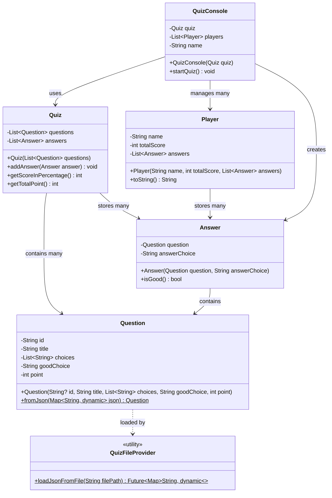

# 🎯 Console Quiz (Dart)

[](W3%20-%20PRACTICE%20-%20Dart%20Layered%20Architecture.pdf)

A clean, modern, and test-covered console quiz app built with Dart. Questions are loaded from JSON, converted into typed models, and played interactively in your terminal.

> School base-project — created for coursework and learning purposes.  
> Owner: Loem KimHour

[▶ View Assignment PDF](W3%20-%20PRACTICE%20-%20Dart%20Layered%20Architecture.pdf)


---

## ⚡️ Highlights

- JSON-driven questions (`lib/data/questions.json`)
- Strong models: `Question`, `Answer`, `Quiz`
- Auto-generated UUID for each `Question` (or supply your own `id` in JSON)
- Case-insensitive answer checking
- Percentage and total points scoring
- Multi-player console flow with a simple scoreboard
- Unit tests that validate the core behavior

---

## 💢 UML Diagram



---

## 🧭 Table of Contents

- Overview
- Demo
- Project Structure
- Getting Started (Requirements, Setup, Run, Test)
- Data Format (JSON)
- Architecture
- Customize
- Troubleshooting
- Ownership & Status
- License

---

## 🔎 Overview

This project demonstrates a small but well-structured console application in Dart. Data is read from JSON, mapped into strongly-typed models, and processed by a tiny domain layer. The UI loop lives in the console, keeping concerns separate and the code easy to follow.

---

## 🖥️ Demo (text transcript)

```text
$ dart lib/main.dart
--- Welcome to the Quiz ---

Your name: Alice
Question: Capital of France? - (10 Points)
Choices: [Paris, London, Rome]
Your answer: paris

Question: 2 + 2 = ? - (50 Points)
Choices: [2, 4, 5]
Your answer: 4

Alice, your score: 100 % correct
Alice, your score in points: 60
Player: Alice     Score: 60
Your name:
--- Quiz Finished ---
```

---

## 🗂 Project Structure

```
lib/
  main.dart                 # Entry: loads JSON, starts console UI
  data/
    quiz_file_provider.dart # JSON reading helper
    questions.json          # Editable quiz data
  domain/
    quiz.dart               # Question, Answer, Quiz models & logic
  ui/
    quiz_console.dart       # Console interaction loop

test/
  quiz_test.dart            # Unit tests for core behavior
pubspec.yaml                # Dependencies: uuid, test
```

---

## 🚀 Getting Started

### Requirements
- Dart SDK 3.x

### Setup
```bash
# From the project root
dart pub get
```

### Run
```bash
# From the project root
dart lib/main.dart
```

### Test
```bash
# From the project root
dart test
```

---

## 🧾 Data Format (JSON)

`lib/data/questions.json` contains an object with a `questions` array:

```json
{
  "questions": [
    {
      "id": "optional-string-id",
      "title": "Capital of France?",
      "choices": ["Paris", "London", "Rome"],
      "goodChoice": "Paris",
      "point": 10
    }
  ]
}
```

Notes:
- `id` is optional. If omitted, a UUID v4 is generated automatically.
- `goodChoice` is compared case-insensitively during answer checks.

---

## 🧠 Architecture


- `Question`
  - Fields: `id`, `title`, `choices`, `goodChoice`, `point`
  - Constructor auto-generates `id` with `uuid.v4()` when not provided
  - `factory Question.fromJson(Map<String, dynamic>)` creates a `Question` from JSON
- `Answer`
  - Binds a `Question` and a user's `answerChoice`
  - `isGood()` compares against `goodChoice` (case-insensitive)
- `Quiz`
  - Stores `questions` and gathered `answers`
  - `getScoreInPercentage()`: returns truncated integer percentage (e.g., 1/3 → 33)
  - `getTotalPoint()`: sums points for correct answers by index alignment with `questions`

Important behavior:
- The console UI clears previous answers between players so scores are per-player.
- `getTotalPoint()` assumes answers are entered in the same order as `questions` (enforced by the console UI). If you later accept answers out of order (e.g., by `id`), switch to summing via `Answer.question` instead of relying on index.

---

## 🛠️ Customize

- Edit or add questions in `lib/data/questions.json`
- To show the question ID in the console, log `question.id` in `quiz_console.dart`
- Change the JSON path in `lib/main.dart` if you move the data file:
  ```dart
  final data = await loadJsonFromFile('lib/data/questions.json');
  ```

---

## 🧯 Troubleshooting

- Path errors: run from the project root and ensure `lib/data/questions.json` exists.
- Type errors: ensure `point` is a number and `choices` is an array of strings.
- “Hangs”: the app waits for your input in the terminal; type and press Enter.

---

## 👤 Ownership & Status

- Owner: Loem KimHour
- Project type: School base-project

---

## 📄 License

This project is for educational/demonstration purposes.

